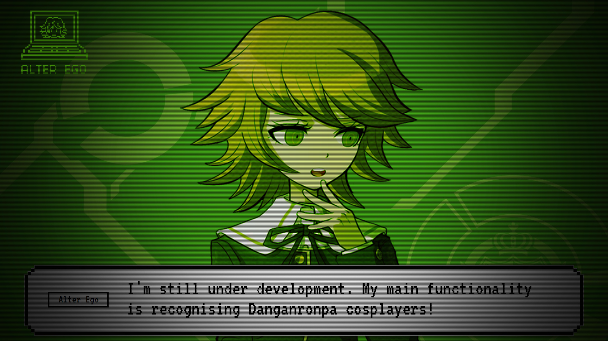

# Alter_Ego

Alter Ego was created on Flask framework.
It's main functions are: Chatbot and recognition of Danganronpa cosplayers.

So far it has 7 DR1 characters with following results on test dataset:

59 / 70 Accuracy of: 84.28571428571429 %
__________________________
Junko: 100.0 %
Chihiro: 80.0 %
Toko: 70.0 %
Mukuro: 80.0 %
Kyoko: 70.0 %
Celestia: 100.0 %
Byakuya: 90.0 %

To activate voice to text push Scroll Lock on your keyboard, and then send the recording by pushing it again.

Greeting:

Wikipedia search:

Functions:

Recognition result:

